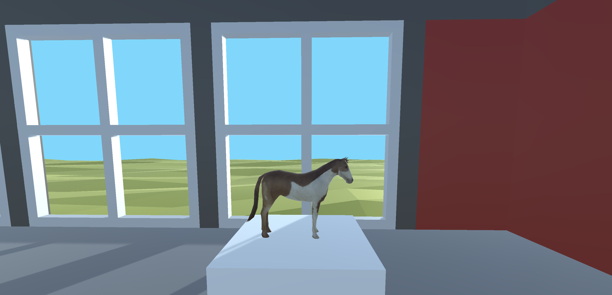

# *v r 2*

# [Play Online](https://www.pippinbarr.com/v-r-to-the-2/webgl) (desktop) or Download for [Mac](https://github.com/pippinbarr/v-r-to-the-2/releases/tag/mac) or [Windows](https://github.com/pippinbarr/v-r-to-the-2/releases/tag/windows)

## Description
*So you made a videogame that hid the things you were trying to exhibit?! Had some doubts but released it anyway?! Now you're trying to crawl back in with a different version that lets the audience see the Unity GameObject menu brought to life?! No, wait, that's me! Enjoy it if you can!*

*v r 2* is a remake of [*v r 2*](https://www.pippinbarr.com/v-r-2/info) in which I make the objects actually visible.

## Documentation
* Read the [Process Documentation](../process)
* Look at the [Code Repository](https://github.com/pippinbarr/v-r-to-the-2) for source code etc.

## Press
* CJ Wheeler. [Pippin Barr's hidden game objects exhibition returns in v r ^2](https://www.rockpapershotgun.com/pippin-barrs-hidden-game-objects-exhibition-returns-in-v-r-2). 24 August 2022.

See the [Press Kit](../press/) for press information

## License
*v r 2* is licensed under a [Creative Commons Attribution-NonCommercial 3.0 Unported License](http://creativecommons.org/licenses/by-nc/3.0/).
