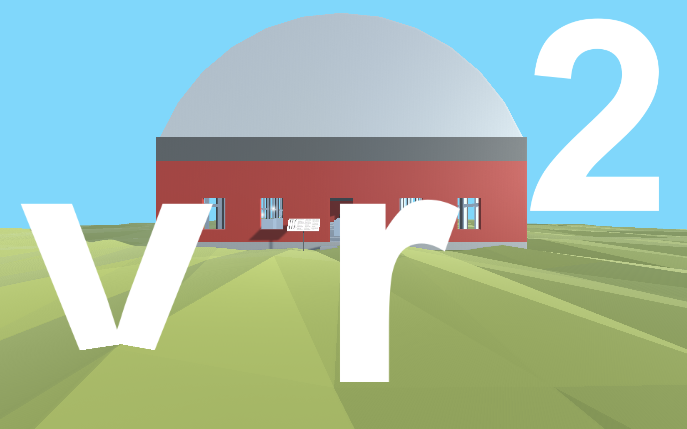
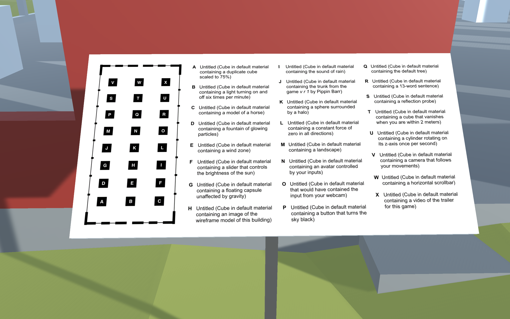
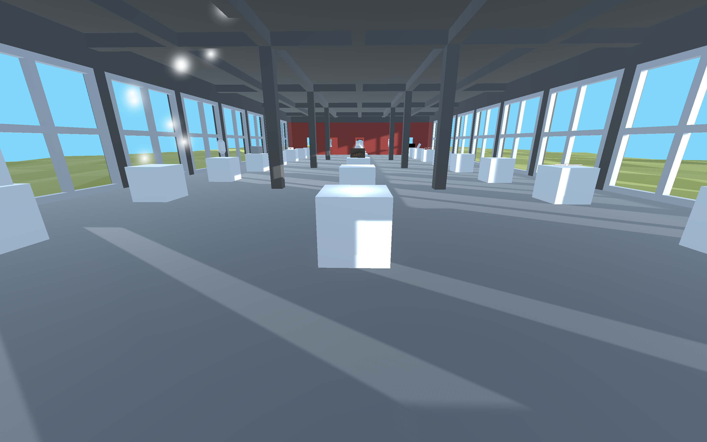
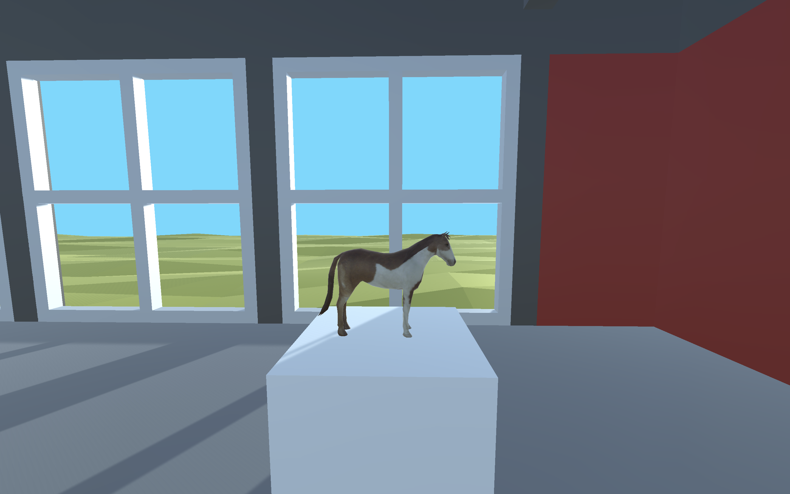
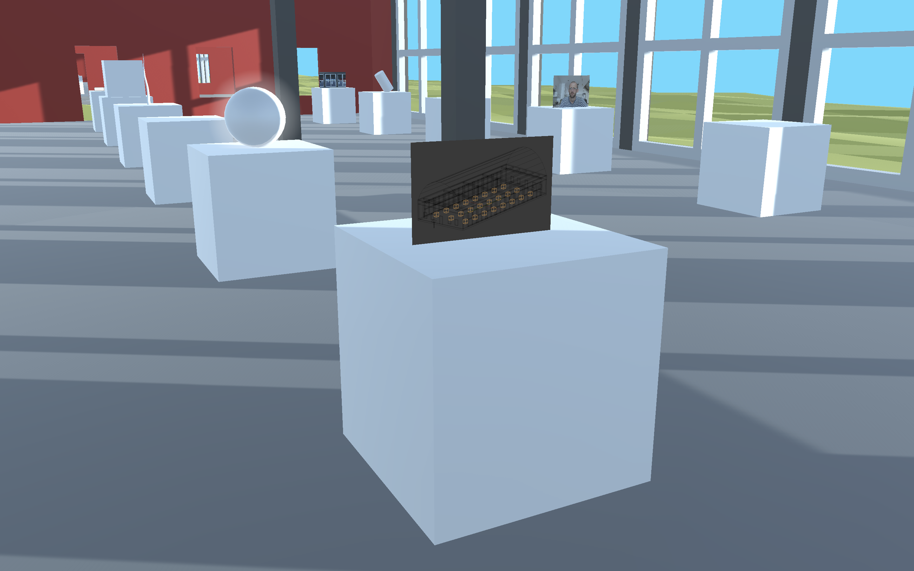
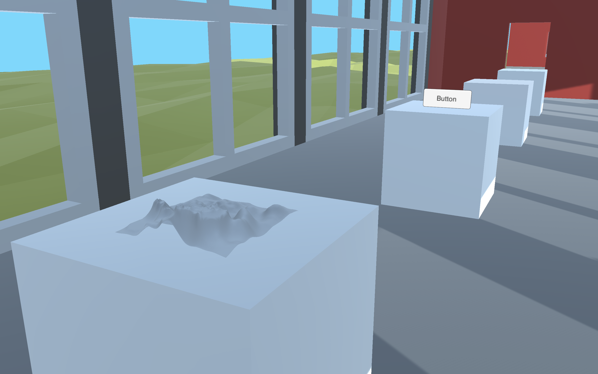
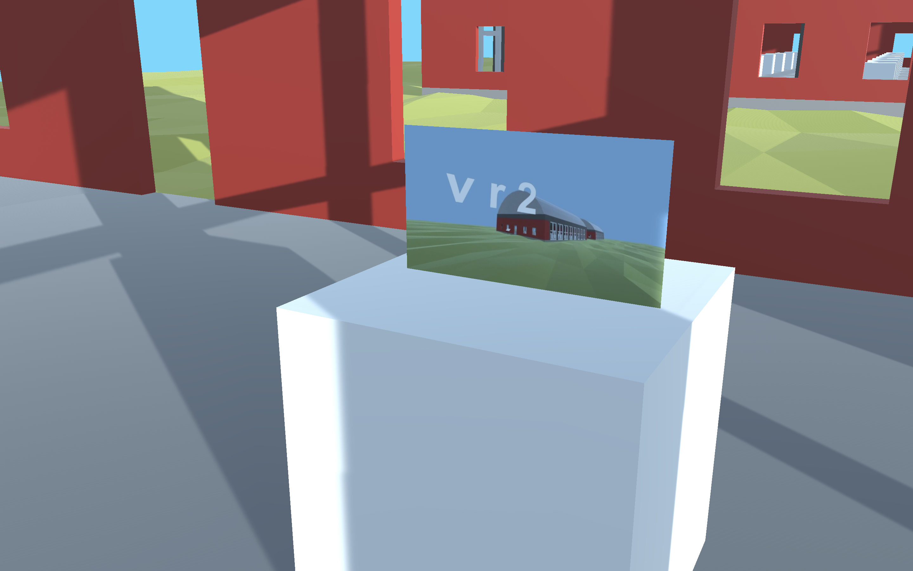

# *v r 2* Press Kit

*...*

### [Play Online](https://www.pippinbarr.com/v-r-to-the-2/webgl) (desktop) or Download for [Mac](https://github.com/pippinbarr/v-r-to-the-2/releases/tag/mac) or [Windows](https://github.com/pippinbarr/v-r-to-the-2/releases/tag/windows)

## The basics

* Developer: [Pippin Barr](http://www.pippinbarr.com/)
* Release: 24 August 2022
* Platform: Browser (desktop), Mac, Windows
* Code repository: https://github.com/pippinbarr/v-r-to-the-2
* Price: $0.00

## Who is this Pippin Barr guy?

Pippin is an experimental game developer who has made games about everything from [Eurovision](http://www.pippinbarr.com/epic-sax-game/info) to [performance art](http://www.pippinbarr.com/the-artist-is-present/info) to [dystopian post-work futures](http://www.pippinbarr.com/it-is-as-if-you-were-doing-work/info). He's n  Professor of Computation Arts in the [Department of Design and Computation Arts](http://www.concordia.ca/finearts/design.html) at [Concordia University](http://www.concordia.ca/) in Montréal. He is also the associate director of the [Technoculture, Art, and Games (TAG)](http://tag.hexagram.ca/) Research Centre, which is part of the [Milieux Institute for Arts, Culture, and Technology](http://milieux.concordia.ca/).

## Description
*v r 2* is a remake of my previous game [*v r 2*](https://www.pippinbarr.com/v-r-2/info) (2016) in which I "exhibited" objects from Unity's `GameObject` menu by hiding them inside default cube objects in a gallery setting.

Now that I'm older and wiser, I've come to feel that hiding the objects was a bit too cute (I was thinking about the artist Gregor Schneider at the time, for what it's worth) and that it would have been better to make the objects visible. So, *v r 2* is that game: it's *v r 2* with all the objects moved up out of the cubes to rest on top of the cubes, that's why the "2" is raised. GET IT???

## History
As above, the key point about *v r 2* is that it's a straightforward remake of [*v r 2*](https://www.pippinbarr.com/v-r-2/info) but with the exhibited objects made to be visible again.

I was at a conference in Kingston, Ontario called *Museums Without Walls* and gave a talk about *v r 2* among other things. In doing so I was forced to constantly reassess the game and to try to justify my hiding of the objects in the cubes. I couldn't really justify it in the end (and admitted as much in my talk), then realised I could just *make the game again*! So when I got home I duplicated *v r 2* and essentially just "moved everything up a bit" to make it visible. (Obviously it was a bit more complex than that in a few places, but that's the gist.)

And here we are, a whole new game.

## Technology
*v r 2* was created in Unity (2021.3.7f1 LTS if you really care about those things). It uses the excellent [Gold Player](https://github.com/Hertzole/gold-player) character-controller by Hertzole.

## License
*v r 2* is licensed under a [Creative Commons Attribution-NonCommercial 3.0 Unported License](http://creativecommons.org/licenses/by-nc/3.0/).

## Features
* A duplicate cube scaled to 75%
* A light turning on and off six times per minute
* A model of a horse
* A fountain of glowing particles
* A wind zone
* A slider that controls the brightness of the sun
* A float capsule unaffected by gravity
* An image of the wireframe model of the building
* The sound of rain
* The trunk from the game v r 1 by Pippin Barr
* A sphere surrounded by a halo
* A constant force of zero in all directions
* A landscape
* An avatar controlled by your inputs
* The input from your webcam if authorized
* A button that turns the sky black
* The default tree
* A 13-word sentence
* A reflection probe
* A cube that vanishes when you are within 2 meters
* A cylinder rotating on its z-axis once per second
* A camera that follows your movements
* A horizontal scrollbar
* A video of the trailer for this game

### [Trailer](https://youtu.be/)

[Trailer on YouTube](https://youtu.be/)

## Images

## Additional Links

- [Process documentation of *v r 2*](https://www.pippinbarr.com/v-r-to-the-2/process/)
- [Commit history of *v r 2*](https://github.com/pippinbarr/v-r-to-the-2/commits/main)

## Credits

* Pippin Barr: design and implementation

## Contact

* Email: [pippin.barr+press@gmail.com](mailto:pippin.barr+press@gmail.com)
* Website: [www.pippinbarr.com](http://www.pippinbarr.com/)
* Twitter: [@pippinbarr](https://www.twitter.com/pippinbarr)
* Instagram: [@pippinbarr](https://www.instagram.com/pippinbarr)
* Facebook: [Pippin Barr](http://www.facebook.com/pippin.barr)
